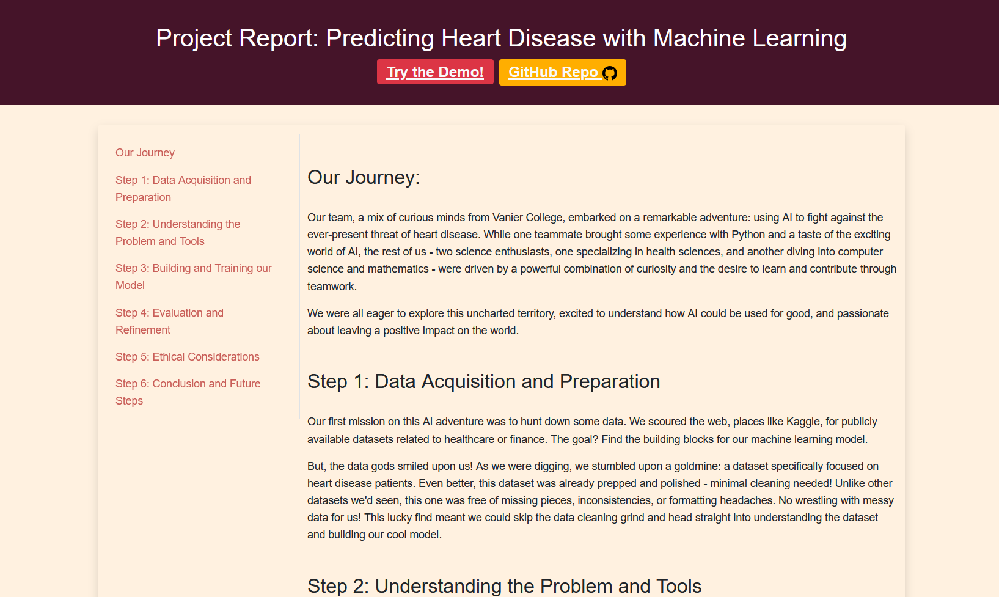
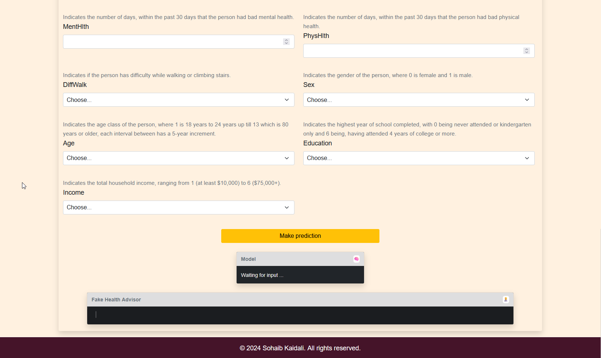

# AI-Powered Heart Disease Predictor

[](https://opensource.org/licenses/MIT)
[](https://www.python.org/downloads/release/python-3101/)
[](https://scikit-learn.org/)
[](https://onnx.ai/)

An end-to-end machine learning project that predicts the likelihood of heart disease from health indicators, deployed as an interactive web application using ONNX for serverless, in-browser inference.

---

### **Live Demo**
**[➡️ Click here to try the interactive Heart Disease Predictor](https://kaidalisohaib.github.io/AICohortW24/website-related/demo.html)**





---

## Table of Contents
- [AI-Powered Heart Disease Predictor](#ai-powered-heart-disease-predictor)
    - [**Live Demo**](#live-demo)
  - [Table of Contents](#table-of-contents)
  - [About The Project](#about-the-project)
  - [Key Features](#key-features)
  - [Tech Stack](#tech-stack)
  - [Project Architecture](#project-architecture)
  - [Getting Started](#getting-started)
    - [Prerequisites](#prerequisites)
    - [Installation](#installation)
  - [Usage](#usage)
  - [Technical Challenges \& Lessons Learned](#technical-challenges--lessons-learned)
      - [1. Challenge: Handling Severe Class Imbalance](#1-challenge-handling-severe-class-imbalance)
      - [2. Challenge: Deploying an ML Model without a Backend Server](#2-challenge-deploying-an-ml-model-without-a-backend-server)
  - [Future Improvements](#future-improvements)
  - [License](#license)
  - [Contact](#contact)

## About The Project

Heart disease remains a leading cause of death globally, making early detection and risk assessment critical for preventative care. This project addresses this challenge by leveraging machine learning to predict the likelihood of a person having heart disease based on 21 key health indicators.

The model is trained on the "Heart Disease Health Indicators" dataset from the BRFSS2015 survey, containing over 250,000 entries. The final product is not just a model, but a fully-interactive and privacy-focused web application that allows users to get instant risk assessments directly in their browser, with no data ever leaving their computer.

## Key Features

- **✅ Machine Learning Model:** A robust Logistic Regression model trained and evaluated against multiple algorithms to predict heart disease with a balanced accuracy of 77%.
- **💻 Interactive Web Demo:** A user-friendly web form allows anyone to input their health metrics and receive an instant prediction.
- **⚡ Real-Time In-Browser Prediction:** Utilizes **ONNX Runtime Web** to run the ML model entirely on the client-side, ensuring user privacy, zero latency, and no server costs.
- **🧠 Model Explainability:** Integrated **SHAP (SHapley Additive exPlanations)** to analyze and visualize which features have the most significant impact on the model's predictions.
- **👩‍⚕️ Personalized Health Feedback:** The application provides generated health advice based on the user's specific inputs, turning the prediction into actionable insight.

## Tech Stack

This project uses a modern stack for both machine learning and web deployment:

| Category          | Technologies                                                                                             |
| ----------------- | -------------------------------------------------------------------------------------------------------- |
| **Machine Learning**  | Python, Scikit-learn, Pandas, NumPy, imbalanced-learn, SHAP, Joblib                                      |
| **Model Deployment**  | ONNX (Open Neural Network Exchange), ONNX Runtime Web                                                    |
| **Frontend**          | HTML5, CSS3, JavaScript, Bootstrap 5                                                                     |
| **Development & Tools** | Jupyter Notebooks, Git, GitHub                                                                           |

## Project Architecture

The project is designed with a clear separation between the offline training environment and the online inference application.

`[INSERT ARCHITECTURE DIAGRAM HERE]`
_**(Note to User: Consider creating a simple diagram showing the flow below and adding it here.)**_

1.  **ML Training Pipeline (Offline):**
    *   **Data Analysis & Preprocessing:** Data is loaded, cleaned, and explored in a Python environment.
    *   **Systematic Model Training:** A pipeline using `Scikit-learn` and `imbalanced-learn` is established to scale features, handle class imbalance, and train multiple models (e.g., Logistic Regression, Random Forest).
    *   **Evaluation & Selection:** Models are rigorously evaluated using metrics suitable for imbalanced datasets like Balanced Accuracy and PR AUC.
    *   **Export to ONNX:** The best-performing model pipeline is serialized into the universal `.onnx` format.

2.  **Inference Application (Frontend):**
    *   **Static Web App:** A simple HTML, CSS, and JS application that can be hosted on any static site provider (like GitHub Pages).
    *   **Model Loading:** The `onnxruntime-web` library fetches the `.onnx` model file.
    *   **Client-Side Inference:** When the user submits the form, their inputs are converted into a tensor and fed into the model directly within their browser's JavaScript engine. The prediction is returned and displayed instantly.

This serverless architecture makes the application highly scalable, fast, and completely private.

## Getting Started

You can run the web demo directly or set up the full machine learning environment to retrain the model.

### Prerequisites

- For the ML environment: Python 3.10.1
- A modern web browser to run the demo.

### Installation

1.  **To Run the Web Demo:**
    - Clone the repository:
      ```sh
      git clone https://github.com/kaidalisohaib/AICohortW24.git
      ```
    - Navigate to the project directory and open `index.html` in your browser.

2.  **To Set Up the ML Environment:**
    - Clone the repository (if you haven't already).
    - Create and activate a virtual environment:
      ```sh
      python -m venv venv
      source venv/bin/activate  # On Windows, use `.\venv\Scripts\activate`
      ```
    - Install the required dependencies:
      ```sh
      pip install -r requirements.txt
      ```
    - Open the notebooks in the `notebooks/` directory to explore the model training process.

## Usage

Navigate to the live demo URL or open `index.html` locally.

1.  Fill out the form with your health information. All fields are required.
2.  Click the "Make prediction" button.
3.  The model will output the predicted likelihood of having heart disease.
4.  The "Fake Health Advisor" will provide generated feedback based on your inputs.

## Technical Challenges & Lessons Learned

This project provided several key learning opportunities that showcase practical engineering skills.

#### 1. Challenge: Handling Severe Class Imbalance

-   **Problem:** The dataset had a ~90/10 split between patients without and with heart disease. A naive model would achieve 90% accuracy by simply always predicting "no disease," making it useless for identifying at-risk individuals.
-   **Solution:** I systematically implemented and compared various resampling techniques from the `imbalanced-learn` library, including oversampling (SMOTE, ADASYN) and undersampling (RandomUnderSampler). By integrating these into a `scikit-learn` pipeline, I could fairly evaluate each technique's impact. I also shifted my primary evaluation metrics from simple accuracy to **Balanced Accuracy** and **Precision-Recall AUC**, which are far more informative for imbalanced problems.
-   **What I Learned:** This taught me the critical importance of choosing the right evaluation metric for the business problem. I gained practical experience in applying advanced data sampling strategies to build a more robust and ethically responsible model.

#### 2. Challenge: Deploying an ML Model without a Backend Server

-   **Problem:** A traditional deployment requires a Python server (like Flask) to host the model and create an API endpoint. This adds complexity, cost, and potential latency.
-   **Solution:** I researched a modern, serverless approach. After training the model pipeline in Python, I converted it into the **ONNX (Open Neural Network Exchange)** format. This standardized file was then loaded and executed directly in the user's browser using the `onnxruntime-web` JavaScript library.
-   **What I Learned:** This project taught me how to decouple model training from inference. I gained valuable, hands-on experience with the ONNX standard for model interoperability and how to build efficient, privacy-preserving, and scalable ML applications using client-side inference.

## Future Improvements

-   [ ] **Containerize with Docker:** Package the Python training environment into a Docker container to ensure perfect reproducibility.
-   [ ] **CI/CD with GitHub Actions:** Create a workflow to automatically run tests on the notebooks and deploy the web application to GitHub Pages on every push to `main`.
-   [ ] **Explore Advanced Models:** Experiment with gradient boosting models like `XGBoost` or `LightGBM`, which often yield higher performance on tabular data.
-   [ ] **Interactive SHAP Visualizations:** Integrate a library like `Chart.js` into the demo to show users which of their inputs most influenced their prediction score, providing greater transparency.

## License

Distributed under the MIT License. See `LICENSE` for more information.

## Contact

Sohaib Kaidali - [GitHub Profile](https://github.com/kaidalisohaib)

Project Link: [https://github.com/kaidalisohaib/AICohortW24](https://github.com/kaidalisohaib/AICohortW24)